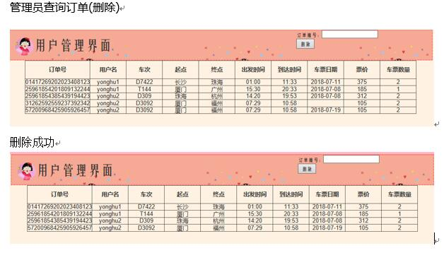

jsp＋html+sql实现

火车站网上售票管理系统
考察火车站售票业务，设计火车站网上售票管理系统。要求：
1、具有方便、快速的售票功能，包括车票的预订和退票功能，能够支持团体的预订票和退票。
2、能够准确地了解售票情况，提供多种查询和统计功能，如车次的查询、时刻表的查询。

2、前台功能
未登录用户时可通过车次或起点终点查询。
未注册用户可注册成为用户后登录。
登录用户：
车次查询：登录后可通过车次或起点终点查询到所查车次的信息等
购票：查询后可输入购票数量，进行购票，生成订单并打印出来。
订单查询：可在我的订单中查看自己的订单输入订单号，可查询订单信息。
退票：订单查询后可选择进行退票操作。
3、后台功能
用户管理：可查询和删除客户。
车次查询：登陆后可通过车次或起点终点查询到所查车次的信息等
增加车次：登陆管理员账号后可添加车次，增加车次信息等
订单查询：可查询单个订单或全部订单
订单管理：可删除订单信息。

哈哈哈是我喜欢的小丸子风格
